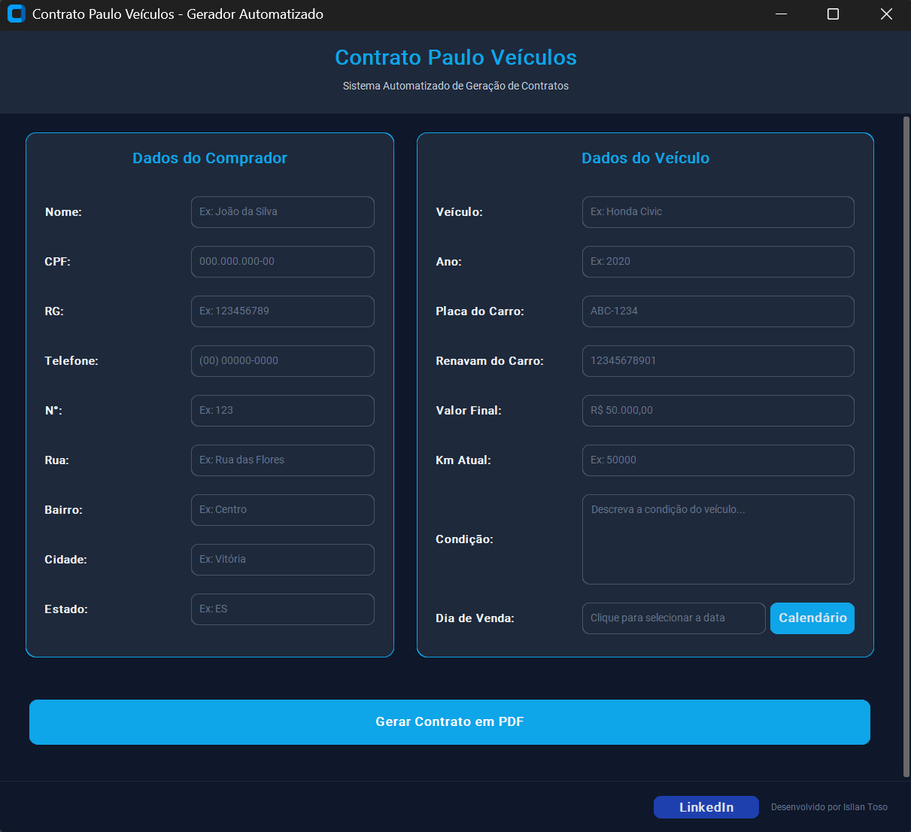

# Vehicle Contract Generator

Desktop application for automated generation of vehicle purchase and sale agreements in PDF format, built with a modular architecture and focused on document automation, validation workflows and maintainable business logic.

The platform streamlines administrative contract generation through structured form validation, automated formatting and secure PDF generation.

---

# Application Preview



---

# Overview

The application collects contract information through a graphical interface, validates required fields, applies automatic formatting rules and generates PDF contracts from customizable templates.

The system supports password-protected PDF generation and was designed with layered architecture principles to isolate business rules, application workflows and infrastructure components.

---

# Core Features

- Desktop graphical interface with CustomTkinter
- Automated contract PDF generation
- Password-protected PDF support
- Required field validation
- Automatic formatting for:
  - CPF
  - Phone numbers
  - Currency values
- Customizable contract templates
- Modular layered architecture
- Maintainable business rule isolation

---

# Technology Stack

| Component | Technology | Minimum Version |
|---|---|---|
| Desktop UI | CustomTkinter | >= 5.2.0 |
| PDF Generation | ReportLab | >= 4.0.0 |
| PDF Encryption | PyPDF2 | >= 3.0.0 |
| Date Components | tkcalendar | >= 1.6.1 |

---

# System Requirements

- Python 3.8+
- Tkinter-compatible environment
  - Included in most official Python distributions for Windows

---

# Installation

## Using uv (Recommended)

From the project root:

```bash
uv sync
```

This command creates the virtual environment in `.venv` and installs all dependencies declared in `pyproject.toml`.

---

## Using pip

Create a virtual environment:

```bash
python -m venv .venv
```

Activate the environment and install the project:

```bash
pip install -e .
```

Alternatively, install dependencies directly:

```bash
pip install -r requirements.txt
```

---

# Running the Application

## Using uv

```bash
uv run contrato
```

---

## Using Python Module Execution

```bash
python -m contrato_veicular.main
```

---

## Direct Execution

```bash
python src/contrato_veicular/main.py
```

---

# Project Architecture

The application follows a layered architecture structure inside:

```text
src/contrato_veicular/
```

## Domain Layer

Responsible for:

- Business rules
- Entities
- Validators
- Data formatters

This layer remains independent from UI and PDF libraries.

---

## Application Layer

Handles:

- Use case orchestration
- Validation workflows
- Contract generation pipelines
- Application coordination

---

## Infrastructure Layer

Responsible for:

- PDF generation
- Template loading
- UI components
- Interface utilities
- External integrations

---

# Engineering Principles

- Layered Architecture
- Separation of Concerns (SoC)
- Modular Business Logic
- Maintainable Desktop Design
- Reusable Validation Pipelines
- Scalable Document Generation Workflows

---

# Repository

```bash
git clone https://github.com/Isllanrx/Contrato-Veicular-PY.git
cd Contrato-Veicular-PY
```

---

# Use Cases

- Vehicle dealership operations
- Administrative automation
- Contract generation systems
- PDF workflow automation
- Internal business tooling

---

# Future Improvements

Potential roadmap enhancements:

- Digital signature integration
- Database persistence layer
- Multi-template support
- Export history management
- Cloud synchronization
- Multi-language contract generation

---

# License

This project is licensed under the MIT License.

See the [LICENSE](LICENSE) file for more details.

---

# Author

**Isllan Toso Pereira**

- GitHub: [Isllanrx](https://github.com/Isllanrx)
- LinkedIn: [Isllan Toso](https://br.linkedin.com/in/isllantoso)
